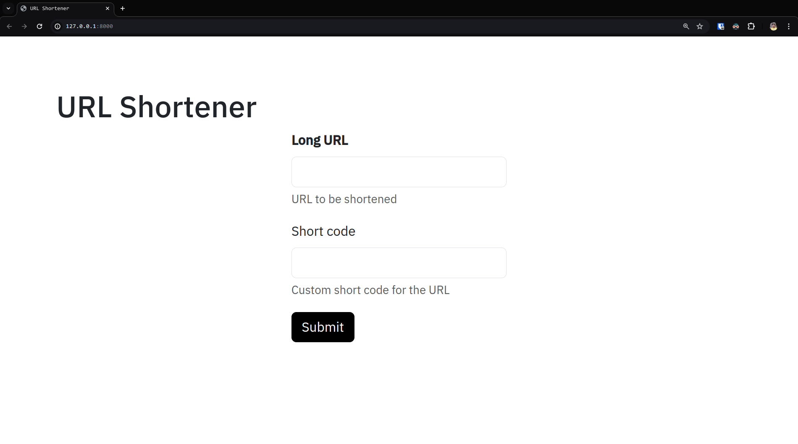

<p align="center">
  <a href="" rel="noopener">
 </a>
</p>

<h1 align="center">URL Shortener</h1>

<div align="center">

[]()
[](/LICENSE)
[](https://urlshortener.amulyaparitosh.in/)
</div>

---
<p align="center"> URL Shortener is a project that shortens the URL and provides a unique short code for each URL. It is a simple project that can be used to shorten the URL even with custom code and use it in the place of the original URL.
    <br>
</p>


## 📝 Table of Contents

- [About](#about)
- [Getting Started](#getting_started)
- [Built Using](#built_using)
- [TODO](./TODO.md)
- [Author](https://github.com/AmulyaParitosh)

## 🧐 About <a name = "about"></a>

This project is a simple URL shortener that shortens the URL and provides a unique short code for each URL. It is a simple project that can be used to shorten the URL even with custom code and use it in the place of the original URL.
It uses firebase to store the URL and the short code in a mapping.

The project is developed using FastAPI which is a modern, fast (high-performance), web framework for building APIs with Python 3.6+ based on standard Python type hints.

A very Simple front end is also provided to shorten the URL which is developed using FastUI.


## 🏁 Getting Started <a name = "getting_started"></a>

### Prerequisites

- Python 3.11
- Poetry
- Docker

### Installing

Follow these steps to install the project on your local machine.

#### 1. Clone the repository

```bash
git clone https://github.com/AmulyaParitosh/UrlShortener.git
```

#### 2. Change the working directory
```bash
cd UrlShortener
```

#### 3. Install the dependencies
```bash
poetry install
```

#### 4. Run the server
```bash
poetry run uvicorn main:app --reload
```

Or with Docker

```bash
docker-compose up
```

#### 5. Open the browser and go to http://localhost:8000



## ⛏️ Built Using <a name = "built_using"></a>

- [Python](https://nodejs.org/en/) - Programming Language
- [FasiAPI](https://www.mongodb.com/) - Web Framework
- [Firebase](https://expressjs.com/) - Realtime Database
- [FastUI](https://vuejs.org/) - Frontend Framework
- [Docker](https://vuejs.org/) - Containerization
